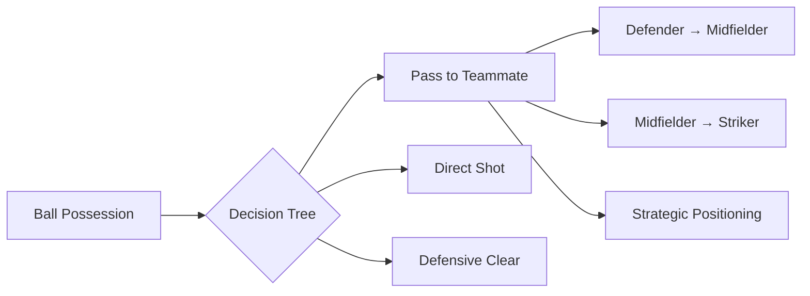

# ⚽ SoccerMind

<div align="center">


**An AI-Driven Football Simulation Game**

[](https://godotengine.org/)
[](https://github.com/SakiburRahman07/SoccerMind)
[](LICENSE)
[](https://github.com/SakiburRahman07/SoccerMind)

*Where Artificial Intelligence meets Beautiful Game*

[🎮 Play Demo](#installation) • [📖 Documentation](#game-description) • [🤖 AI Algorithms](#ai-algorithms) • [🏗️ Architecture](#project-structure)

</div>

---

## 🎯 Game Description

**SoccerMind** is an innovative AI-driven football simulation where two autonomous teams compete in strategic gameplay. Each team consists of specialized players controlled by different AI algorithms, creating dynamic and unpredictable matches.

### 🎪 Team Formation

Each team deploys **5 specialized players**:

| Position | Role | Primary Function |
|----------|------|------------------|
| 🥅 **Goalkeeper** | Last Defense | Shot blocking & trajectory prediction |
| 🛡️ **Defender** | Zone Protection | Opponent blocking & ball clearing |
| ⚡ **Midfielders** (×2) | Possession Control | Balance defense/attack & distribution |
| 🎯 **Striker** | Goal Scorer | Attacking & finishing |

> **Note**: Team formation can be customized based on tactical requirements

### 🏟️ Game Environment

- **Grid-based Field**: Strategic movement across defined zones
- **Real-time Decision Making**: Continuous AI evaluation and action
- **Dynamic Ball Physics**: Realistic movement with speed variations
- **Multi-dimensional Play**: Support for both 2D and 3D gameplay

---

## 🎮 Game Rules

### ⚽ Ball Possession & Strategy



#### 🎯 Passing Mechanics
- **Straight Pass**: Direct path with speed control
- **Projected Pass**: Predictive positioning
- **Lob Pass**: Over-the-top tactical move

#### 🛡️ Defensive Operations
- **Interception**: Active ball retrieval
- **Zone Marking**: Positional defense
- **Pressure Application**: Opponent disruption

#### 🥅 Scoring System
- Goals scored when ball crosses opponent's goal line
- Goalkeeper interference and save attempts
- Shot angle and power calculations

---

## 🤖 AI Algorithms

### 🏃‍♂️ Outfield Players

<details>
<summary><strong>🛡️ Defender - Depth-First Search (DFS)</strong></summary>

```gdscript
# Aggressive zone exploration for defensive coverage
func explore_defensive_zones():
    var visited_zones = []
    var stack = [current_position]
    
    while not stack.empty():
        var zone = stack.pop_back()
        if zone not in visited_zones:
            evaluate_threat_level(zone)
            add_adjacent_zones(stack, zone)
```

**Strategy**: Deep exploration of defensive corridors to block opponent advances
</details>

<details>
<summary><strong>⚡ Midfielder 1 - Breadth-First Search (BFS)</strong></summary>

```gdscript
# Systematic exploration for possession maintenance
func maintain_possession():
    var queue = [ball_position]
    var explored = []
    
    while not queue.empty():
        var current = queue.pop_front()
        if is_safe_position(current):
            return move_to_position(current)
        add_adjacent_safe_zones(queue, current)
```

**Strategy**: Systematic exploration of nearest grids for optimal positioning
</details>

<details>
<summary><strong>⚡ Midfielder 2 - Greedy Best-First Search</strong></summary>

```gdscript
# Quick path selection for ball progression
func quick_progression():
    var best_move = null
    var best_score = -INF
    
    for move in available_moves:
        var score = heuristic_evaluation(move)
        if score > best_score:
            best_score = score
            best_move = move
    
    return execute_move(best_move)
```

**Strategy**: Rapid decision-making for immediate ball advancement
</details>

<details>
<summary><strong>🎯 Striker - A* Algorithm</strong></summary>

```gdscript
# Optimal pathfinding to goal
func find_optimal_path_to_goal():
    var open_set = [current_position]
    var g_score = {current_position: 0}
    var f_score = {current_position: heuristic(current_position, goal)}
    
    while not open_set.empty():
        var current = get_lowest_f_score(open_set, f_score)
        
        if current == goal:
            return reconstruct_path(current)
        
        for neighbor in get_neighbors(current):
            evaluate_path_cost(neighbor, g_score, f_score)
```

**Strategy**: Balanced approach considering distance, obstacles, and goal probability
</details>

### 🥅 Goalkeeper Intelligence

<details>
<summary><strong>🧠 Alpha-Beta Pruning</strong></summary>

```gdscript
# Advanced trajectory prediction and decision pruning
func predict_and_save(depth, alpha, beta, maximizing_player):
    if depth == 0 or is_terminal_state():
        return evaluate_shot_outcome()
    
    if maximizing_player:
        var max_eval = -INF
        for trajectory in possible_trajectories:
            var eval = minimax(depth - 1, alpha, beta, false)
            max_eval = max(max_eval, eval)
            alpha = max(alpha, eval)
            if beta <= alpha:
                break  # Beta cutoff
        return max_eval
```

**Strategy**: Evaluates multiple ball trajectories, pruning inefficient decision branches
</details>

---

## 🧩 Fuzzy Logic System

### 🎯 Decision Enhancement Engine

Our fuzzy logic system adds human-like uncertainty and decision-making:

#### 📤 Passing Style Selection
```
Inputs:
├── Teammate Distance [0-100]
├── Opponent Density [0-10]
└── Ball Control Time [0-5s]

Outputs:
├── Straight Pass [0-1]
├── Lob Pass [0-1]
└── Through Pass [0-1]
```

#### ⚡ Pass Speed Control
```
Inputs:
├── Pressure Level [Low, Medium, High]
├── Time Possession [0-10s]
└── Distance to Target [0-50m]

Outputs:
├── Slow Pass [0.3x speed]
├── Medium Pass [0.6x speed]
└── Fast Pass [1.0x speed]
```

#### 🥅 Goalkeeper Reaction System
```
Inputs:
├── Shot Angle [-90° to +90°]
├── Ball Speed [0-30 m/s]
└── Distance to Goal [0-20m]

Outputs:
├── Dive Left [0-1]
├── Dive Right [0-1]
└── Block Center [0-1]
```

---

## 🏗️ Project Structure

```
📦 SoccerMind/
├── 🎨 assets/                 # Game visual resources
│   ├── Ball.png              # Ball sprite
│   ├── Field.png             # Field background
│   └── Player.png            # Player sprite
├── 🎬 scenes/                 # 2D Scene files
│   ├── Main.tscn             # Main game scene
│   ├── Player.tscn           # Player entity
│   ├── Ball.tscn             # Ball physics
│   └── Field.tscn            # Game field
├── 🌍 scenes3d/              # 3D Scene files
│   ├── Main3D.tscn           # 3D main scene
│   ├── Player3D.tscn         # 3D player model
│   └── Ball3D.tscn           # 3D ball physics
├── 🧠 scripts/               # 2D Game logic
│   ├── GameManager.gd        # Core game controller
│   ├── Player.gd             # Player behavior
│   ├── Ball.gd               # Ball physics
│   └── 🤖 ai/               # AI algorithm implementations
│       ├── DefenderDFS.gd    # Defender AI (DFS)
│       ├── MidfielderBFS.gd  # Midfielder AI (BFS)
│       ├── StrikerAStar.gd   # Striker AI (A*)
│       ├── GoalkeeperAlphaBeta.gd # Goalkeeper AI
│       └── Fuzzy.gd          # Fuzzy logic system
├── 🌐 scripts3d/            # 3D Game logic
│   └── 🤖 ai/               # 3D AI implementations
└── 📋 project.godot          # Godot project configuration
```

---

## 🚀 Installation & Setup

### Prerequisites
- **Godot Engine 4.x** or later
- **Git** for version control

### Quick Start

```bash
# Clone the repository
git clone https://github.com/SakiburRahman07/SoccerMind.git

# Navigate to project directory
cd SoccerMind

# Open with Godot Engine
godot project.godot
```

### 🎮 Running the Game

1. **Open Godot Engine**
2. **Import Project** → Select `project.godot`
3. **Choose Game Mode**:
   - 🎯 **2D Mode**: Click `scenes/Main.tscn`
   - 🌍 **3D Mode**: Click `scenes3d/Main3D.tscn`
4. **Press F5** to run the simulation

---

## 🎯 Expected Outcomes

### 🏆 Game Features
- [x] **Realistic AI Behaviors**: Each position demonstrates unique playing styles
- [x] **Dynamic Decision Making**: Fuzzy logic creates human-like unpredictability
- [x] **Algorithm Comparison**: Real-time evaluation of different AI approaches
- [x] **Interactive Simulation**: Watch autonomous teams compete strategically

### 📊 Performance Metrics
- **Decision Speed**: Algorithm response time analysis
- **Goal Conversion**: Striker effectiveness measurement
- **Defensive Success**: Interception and save rates
- **Possession Control**: Midfielder dominance statistics

---

## 🔬 Algorithm Analysis

| Algorithm | Position | Strengths | Weaknesses |
|-----------|----------|-----------|------------|
| **DFS** | Defender | Deep zone coverage | May miss immediate threats |
| **BFS** | Midfielder | Systematic exploration | Can be slow in urgent situations |
| **Greedy** | Midfielder | Fast decisions | May not find optimal solutions |
| **A*** | Striker | Optimal pathfinding | Computationally intensive |
| **Alpha-Beta** | Goalkeeper | Excellent prediction | Requires game tree depth |

---

## 🤝 Contributing

We welcome contributions! Please see our [Contributing Guidelines](CONTRIBUTING.md) for details.

### 🎯 Areas for Enhancement
- [ ] Machine Learning integration
- [ ] Advanced physics simulation
- [ ] Multiplayer support
- [ ] Enhanced 3D graphics
- [ ] Tournament mode

---

## 📜 License

This project is licensed under the MIT License - see the [LICENSE](LICENSE) file for details.

---

## 👨‍💻 Author

**Sakibur Rahman**
- GitHub: [@SakiburRahman07](https://github.com/SakiburRahman07)
- Project: [SoccerMind](https://github.com/SakiburRahman07/SoccerMind)
**Shoumik Barman Polok**
- GitHub: [@Polok04](https://github.com/Polok04)
- Project: [SoccerMind](https://github.com/Polok04/SoccerMind)
---

<div align="center">

### 🌟 Star this project if you found it interesting!

**Made with ❤️ and ⚽ by the SoccerMind Team**

[⬆ Back to Top](#-soccermind)

</div>